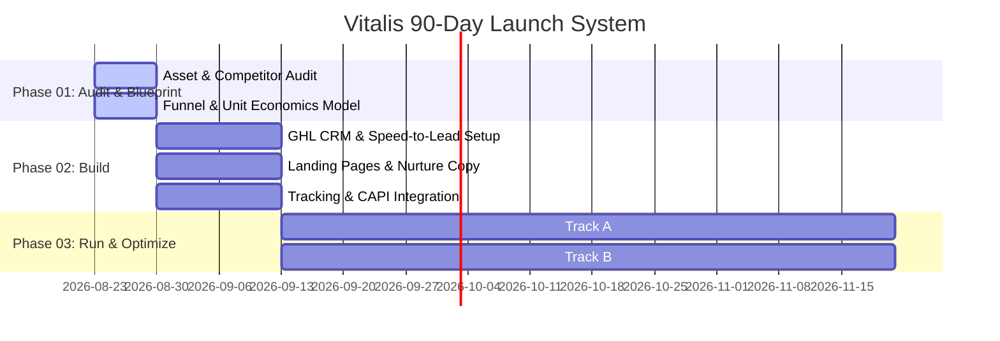

# Vitalis Health & Performance — 90-Day Launch System
## Master Orchestration & Subagent Command Center

**Client:** Sergio Enriquez &middot; Vitalis Health & Performance ([vitalishealthco.com](https://www.vitalishealthco.com))  
**System Blueprint:** [automatescale.com/vitalis](https://automatescale.com/vitalis)  
**Orchestrator:** Adam Palmer (Lead System Architect)  
**Status:** In Progress &middot; Subagents Active  

---

### 🏛️ Executive Summary

Vitalis is transitioning from organic word-of-mouth to a predictable client acquisition and retention engine for mobile IV therapy across the Dallas–Fort Worth metroplex. 

- **Core Base:** Centered at **Dallas Love Field** with a 15-mile zero-travel-fee primary service radius (Uptown, Highland Park, University Park, Preston Hollow, Lakewood, Downtown Dallas, Oak Lawn).
- **Offer Menu:** The Foundation ($224), The Reset ($249), Ascend ($274), Rebuild ($324), Immune Defense ($324), Radiance ($374), The Reserve ($500), NAD+ Protocols ($900/mo).
- **Memberships:** The Foundation ($189/mo), The Protocol ($369/mo), Vitalis Elite ($699/mo).
- **Core Constraints & Targets:** 
  - Founder availability: 3 hospital shifts/week as an RN.
  - Delivery capacity: 8 drips/week (~32–35 bookings/month).
  - Target CPA: **$60–$120** per booked appointment.
  - Show Rate Target: **75%+** (driven by instant SMS + 5-minute confirmation call + deposit).
  - Rebook Rate Target: **30%+** by Day 90.

---

### 👥 Active Subagents & Workstreams

| Specialist | Role | Target Deliverable | Subagent ID | Status |
| :--- | :--- | :--- | :--- | :--- |
| **Saul Treger** | Paid Traffic & Media Buying Lead | [`vitalis-paid-media-blueprint.md`](file:///Users/palmer/vitalis-paid-media-blueprint.md) | `b7efa29a` | 🟢 Running in Background |
| **Mo Berkane** | CRM & Automation Systems Architect | [`vitalis-crm-automation-spec.md`](file:///Users/palmer/vitalis-crm-automation-spec.md) | `91fba67e` | 🟢 Running in Background |
| **Gabe** | Funnel Architect & Conversion Copywriter | [`vitalis-funnel-copywriting.md`](file:///Users/palmer/vitalis-funnel-copywriting.md) | `ebbe5c7c` | 🟢 Running in Background |
| **Sagar Desai** | Organic Content & Newsletter Strategist | [`vitalis-organic-strategy.md`](file:///Users/palmer/vitalis-organic-strategy.md) | `a8ce22ff` | 🟢 Running in Background |

---

### 🗺️ Workstream Breakdown

#### 1. Saul Treger &mdash; Paid Traffic & Dallas Intelligence
- **Dallas Competitor Teardown:** Analysis of local IV competitors on Meta Ad Library and Google Local Services (pricing, hooks, creative formats, weaknesses).
- **Geofence & Drive-Time Strategy:** Hyper-local targeting within Love Field 15-mi radius; outer ring fee management ($50 for 15–25mi, $100 for 25–40mi); hotel and corporate concierge capture.
- **Paid Ads Architecture:** Meta & Google Ads campaign structures, audience testing across 4 pillars (Athletes, Hangover, Longevity/NAD+, Beauty), budget pacing to 8 drips/week capacity.
- **On-Site Partnership Playbook:** QR code lead capture and rapid-activation mechanics for partner gyms and luxury high-rises.

#### 2. Mo Berkane &mdash; CRM & Speed-to-Lead Architecture
- **GoHighLevel Schema:** Custom fields for address verification, audience pillar tagging, referral tracking, and 8-stage pipeline management.
- **Speed-to-Lead Under 5 Minutes:** Immediate automated SMS, automated callback task / AI Voice Agent integration, reminder cadence, and no-show rescue sequences.
- **Booking Calendar Engine:** Hospital shift blackout logic (3 days/week) and address qualifier gate before appointment confirmation.
- **Post-Visit Retention & Ascension:** 2-hour feeling check-in, 24-hour Google Review filter, 14-day rebooking nudge, 30-day membership conversion ($189/$369/$699), and NAD+ recurring protocol ladder ($900/mo).
- **Tracking & Analytics:** Meta CAPI server-side integration, GA4, Call Tracking Metrics, and weekly client reporting dashboard.

#### 3. Gabe &mdash; Funnels, Copy & Conversion
- **4 Dedicated Landing Pages:**
  - *Athletes & Performance* (Rebuild $324 — muscle recovery, hydration, amino acids)
  - *Hangover & Event Recovery* (The Reset $249 / The Foundation $224 — rapid headache/nausea relief)
  - *Longevity & Cellular Health* (The Reserve $500 / NAD+ Protocols)
  - *Beauty & Radiance* (Radiance $374 — glutathione, biotin, bridal/glow)
- **Lead Magnet Guide:** *"The Dallas High-Performance & Cellular Recovery Protocol"* compiled from Substack newsletter archive.
- **Downstream Sequences:** 5-part email nurture + 4-part SMS sequence matching ads to conversion.
- **Service Area & Pricing UX:** Interactive radius checker and transparent pricing wireframes.

#### 4. Sagar Desai &mdash; Organic Strategy & Newsletter
- **Dual-Account Strategy:** Brand page (`@vitalishealthco` — clinical authority, luxury concierge) vs. Founder page (Sergio Enriquez — ICU nurse storytelling, Dallas lifestyle, behind-the-scenes).
- **30-Day Content Matrix:** 4 posts/week across all 4 pillars with visual shot lists, hook formulas, and audio cues.
- **Substack Conversion Funnel:** Transitioning newsletter from passive reading to an active lead generation asset with embedded CTAs syncing directly into GoHighLevel.
- **Organic-to-Paid Creative Flywheel:** System for testing organic reels/TikToks and promoting winning hooks into Saul's paid ad campaigns.

---

### ⏱️ Phase Timeline & Milestones

